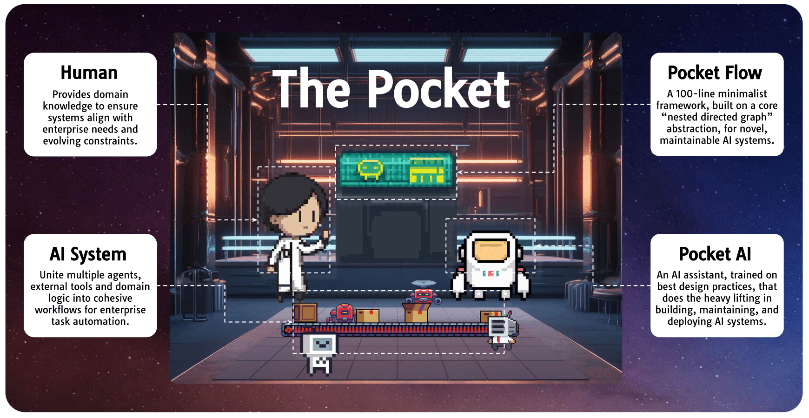

<h1 align="center">The Pocket - Human-AI Co-Design for AI Systems</h1>

  

- 🧙 **AI systems**—where multiple AI components interact to solve complex, real-world tasks—are vital in enterprise automation. 

- 🌈 We envision a future of **Human-AI co-design**: humans clarify objectives, while AI assists in implementing systems.

- 🔮 Introducing **The Pocket**, a Human-AI Co-Design platform for building AI systems. It has two core components:

    - 🏭 **[Pocket Flow](https://github.com/The-Pocket/PocketFlow)**: a 100-line vendor-agnostic framework. Despite its minimalism, it supports widely adopted AI patterns: batched workflows, multi agents, and retrieval-augmented generation.
    
    - 🤖 **Pocket AI**: an assistant trained in best system design practices, can integrate domain-specific logic and external APIs through an enterprise knowledge base.
    
- ✨ Together, **Pocket Flow** and **Pocket AI** offer a platform for prototyping, refining, and deploying AI systems.

View the full essay [here](https://github.com/The-Pocket/.github/blob/main/profile/essay.md).
