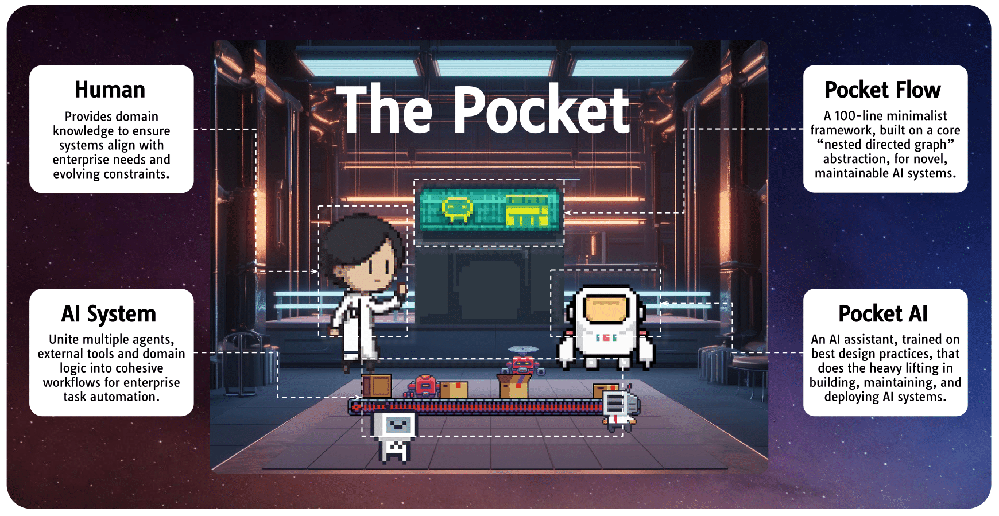

<h1 align="center">The Pocket - Human-AI Co-Design for AI Systems</h1>

  

# Enterprises and AI Automation

Enterprises often deal with repetitive tasks like data entry, routine reporting, and invoice processing—activities that are both time-consuming and expensive. While large language models (LLMs) demonstrate [impressive intelligence for automation](https://arxiv.org/abs/2303.12712), a single LLM call isn’t enough to handle these complex tasks reliably. [**Compound AI systems**](https://bair.berkeley.edu/blog/2024/02/18/compound-ai-systems/) integrate multiple LLM calls with external APIs to address these challenges. They are now used across industries to streamline automation and improve decision-making.

Building AI systems, however, requires careful planning. It involves deciding when and how to call each LLM, how to break down tasks, how to combine different components, when to include human feedback, and which APIs or tools to use. Making the right decisions is essential to ensure that the final output is both accurate and reliable.

## Challenges in Fully Automating AI System Design

To speed up AI system development, some system optimizers—like [DSPy](https://github.com/stanford-futuredata/dspy), [Trace](https://arxiv.org/abs/2406.16218), and [DocETL](https://www.docetl.org/)—aim to fully automate it by exploring the design space based on specified input and output data. However, they face two main challenges:

1. **Limited Search Space**:  DSPy, for instance, only handles prompt engineering and chaining within its predefined set of operators. It cannot build agents, create novel retrieval mechanisms, integrate human feedback, or incorporate external APIs.

2. **Ambiguous Input/Output**:  Real-world tasks are often ambiguous, and the desired outputs cannot always be defined ahead of time. Typically, humans need to iterate multiple times—comparing different output candidates—to establish clear evaluation criteria.

In practice, fully automating AI system design is still out of reach. Human judgment and feedback remain crucial. 

Instead, **we envision a future of Human-AI co-design for AI systems**, where each partner brings distinct strengths across the entire lifecycle (Table 1). Business users clarify ambiguous requirements by grounding them in real-world constraints and business logic, ensuring the system’s feasibility from the start. Engineers then translate these needs into a coherent technical architecture, drawing on their experience to manage integrations and maintain robust performance. Meanwhile, AI assistants take on much of the coding, testing, deployment, and maintenance, accelerating development cycles and allowing for rapid iteration. This collaboration enables humans to guide strategic decisions while AI handles routine tasks, ultimately producing systems that balance high performance with real-world viability.

| **Stage**              | **Human**               | **AI**                 | **Details**                                                                                                                                                                                         |
| :------------------------: | :-------------------------: | :------------------------: | :-----------------------------------------------------------------------------------------------------------------------------------------------------------------------------------------------------: |
| Requirements    | ★★★   *High*             | ★☆☆   *Low*             | **Human:** Business Users and Product Managers navigate ambiguity, clarify scope, reconcile conflicting requirements, and handle business/political considerations.   **AI:** Takes notes or summarizes business user discussions into initial drafts.         |
| Design         | ★★☆   *Medium*           | ★★☆   *Medium*          | **Human:** Engineers provide documentation for external tools, ensure correct APIs and integration points, and offer feedback on the designs. **AI:** Proposes high-level workflows and data schema designs.                                |
| Prototype    | ★★☆   *Medium*           | ★★☆   *Medium*          | **Human:** Engineers review the code and refine design decisions. Product Managers provide sanity checks on prototypes. **AI:** Handles heavy coding, code refactoring, and documentation generation, quickly producing prototypes.       |
| Testing       | ★★☆   *Medium*           | ★★☆   *Medium*          | **Human:** Engineers run exploratory tests to validate real-world scenarios. **AI:** Automatically generates tests (unit, integration), mock data, identifies bottlenecks, and suggests optimizations.                                  |
| Deployment      | ★☆☆   *Low*              | ★★★   *High*            | **Human:** Engineers handle complex or unusual deployment incidents. **AI:** Configures CI/CD pipelines, monitors reliability, and raises issues.                                                                                         |
| Maintenance     | ★☆☆   *Low*              | ★★★   *High*            | **Human:** Engineers finalize approvals on fixes and handle complex escalations. **AI:** Analyzes logs, monitors performance, and proposes fixes.                                                                                         |

<em>Table 1: Different Roles and Degrees of Involvement for Human and AI Throughout AI Systems Build</em>

## The Bottleneck in Human-AI Co-Design for AI Systems

While such Human-AI co-design shows early promise in standard web app prototyping (e.g., [bolt.new](https://bolt.new), [cursor.ai](https://cursor.ai)), it remains largely absent in AI system design. We find the main bottleneck is not the AI, but the **suitable frameworks for AI systems**:

1. **Full-stack Frameworks**: Front-end frameworks like [React.js](https://react.dev/), [Vue.js](https://vuejs.org/), and [Angular](https://angular.io/)—and back-end frameworks like [Node.js](https://nodejs.org/en) and [Express.js](https://expressjs.com/)—offer excellent abstractions for both human and, potentially, AI programmers. For example, Vue.js employs a reactive data model that encapsulates the complexities of direct DOM manipulation, resulting in a reusable, component-based, and highly expressive approach for implementing UI interactions.

2. **AI System Frameworks**:  Existing AI system frameworks (e.g., [AutoGen](https://github.com/microsoft/autogen), [LangChain](https://www.langchain.com/langchain), [LangGraph](https://www.langchain.com/langgraph),[CrewAI](https://www.crewai.com/), [Pydantic](https://docs.pydantic.dev/)) are typically limited to vendor-specific wrappers (e.g., for OpenAI models, Pinecone, etc.) and include numerous feature-based abstractions that are not fundamental—such as text splitters—and application-specific abstractions like the Conversational Retrieval Chain, which only works for conversational retrieval tasks. Moreover, many of these abstractions rely on hard-coded prompts under the hood, making them inflexible. As a result, many practitioners abandon these frameworks altogether, leading to ad hoc, non-modular, and difficult-to-reuse code. The core challenge lies in designing abstractions suitable for AI system development.

## Introducing The Pocket: A Human-AI Co-Design Platform

To this end, we propose **The Pocket**, a Human-AI Co-Design platform for AI systems. The Pocket has **two core components**: an AI framework (**Pocket Flow**) and an AI assistant (**Pocket AI**).

1. **Pocket Flow**: Instead of having a monolithic framework that tries to incorporate all vendor and application logic, **Pocket Flow** is a minimalistic framework (in exactly 100 lines of code) that offers *only* the core abstraction of a “nested directed graph” for AI systems. (1) **Modularity**: We use *Nodes* as the smallest reusable units that are easy to build, test, and maintain. (2) **Expressiveness**: Support for various high-level AI design paradigms such as agents, workflows, map-reduce chains, user feedback, and multi-agent synchronization, among others. Furthermore, Pocket Flow includes extensions for workflow visualization, logging, debugging, and duration execution (e.g., state persistence, automatic retries) to facilitate efficient development and deployment.

2. **Pocket AI**: All the complexity and adaptability reside in **Pocket AI**—the AI assistants that use **Pocket Flow** for tailored enterprise solutions. (1) **Textbook-like Training**: Trained on structured resources to master the framework and best practices for both development and deployment. (2) **On-Demand Web Search**: Access to web search for retrieving the latest documentation on tools and APIs, avoiding hard-coded dependencies and vendor lock-in. (3) **Customization**: Adaptability to business- or application-specific logic through a retrieval-augmented generation layer, enabling customization based on enterprise knowledge.

